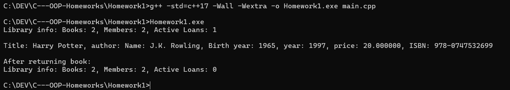

# Проект мини "Библиотека"

## Описание
Проектът „Библиотека“ представлява малка C++ система за управление на книги, читатели и заеми.
### Тя демонстрира основни обектно-ориентирани концепции в C++:
    - Конструктори и деструктори
    - Капсулация и достъп чрез getters и setters
    - Const-коректност и валидация на данни
    - Статични членове и методи
    - Добри ООП практики в реалистичен контекст

## Структура
     dealership/
     ├── Autor.h
     ├── Book.h
     ├── DOMASHNOCPP.png
     ├── Liblary.h
     ├── Loan.h
     ├── Member.h
     ├── README.md
     └── main.cpp
## Компилация и изпълнение
### Отворете cmd.exe(Win + r), влезте в папката на проекта и изпълнете: 
          g++ -std=c++17 -Wall -Wextra main.cpp -o "imeto".exe
### След това:
          "imeto".exe

## Примерен изход: 
    Library info: Books: 2, Members: 2, Active Loans: 1

    Title: Harry Potter, author: Name: J.K. Rowling, Birth year: 1965, year: 1997, price: 20.000000, ISBN: 978-0747532699

    After returning book:
    Library info: Books: 2, Members: 2, Active Loans: 0
## Класове
### Клас Author:
     Съдържа име и година на раждане на автора, с валидация и метод за текстово представяне.
### Клас Book:
     Представя книга с автор, заглавие, година, цена и ISBN; брои всички създадени книги чрез static член.
### Клас Member:
     Представя читател с име, членски номер и година на присъединяване, с проверки за валидност на данните.
### Клас Loan:
     Моделира заем на книга с ISBN, член, дати за старт и край, и статус „върната/не върната“.
### Клас Author:
     Съхранява книги, читатели и заеми; добавя, търси и управлява наличностите и заемите, връщайки обобщена информация.
### Всеки клас съдържа(освен определени):
    - Конструктори: по подразбиране, параметризиран, копиращ, преместващ
    - Оператори присвояване: копиращ, преместващ
    - Деструктор
    - Методи за текстово представяне: to_string()
    - Getters и Setters
    - Статични методи
## Екранна снимка

## Автор
Име: Георги Станоев  
Номер: 22205 
Курс: Обектно-ориентирано програмиране (C++)
Дата: 04.10.2025
